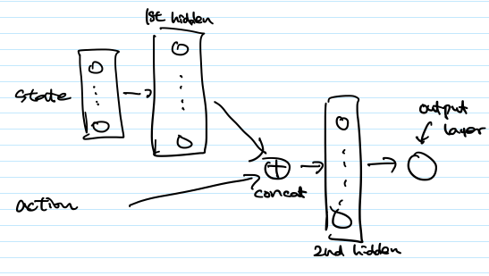
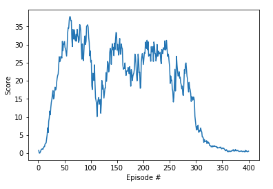
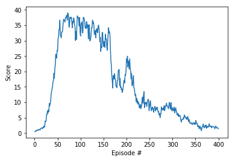

**Udacity's Deep Reinforcement Learning Nanodegree**

## Report on Continuous Control project

### Short description on Deep Deterministic Policy Gradient 

This project is to train an agent whose action space is continuous using an reinforcement learning method called Deep Deterministic Policy Gradient (DDPG). DDPG is a kind of "Actor-Critic" method. Unlike typical critic which is used as a baseline to train an actor, the critic in DDPG is used to maximize the Q value over the next state. With this, it overcomes the limit of DQN, in-ability to be used in continunous action space.

In DDPG, an actor is used to approximate the optimial policy deterministrically, and the critic learns to evalutate the optimal action value function by using the actor's best believed action.

#### Model architecture

**1. Actor network**

The actor network is a multi-layer perceptron (MLP) with 2 hidden layers, which maps states to actions.

   * Input Layer —> 1st hidden layer (128 neurons, ReLu) —> Batch Normalization —> 2nd hidden layer (128 neurons, ReLu) —> Output layer (tanh)

```py
class Actor(nn.Module):
    """Actor (Policy) Model."""

    def __init__(self, state_size, action_size, seed=0, fc1_units=128, fc2_units=128):
        super(Actor, self).__init__()
        self.seed = torch.manual_seed(seed)
        self.fc1 = nn.Linear(state_size, fc1_units)
        self.fc2 = nn.Linear(fc1_units, fc2_units)
        self.fc3 = nn.Linear(fc2_units, action_size)
        self.bn1 = nn.BatchNorm1d(fc1_units)
        self.bn2 = nn.BatchNorm1d(fc2_units)
        self.reset_parameters()

    def forward(self, state):
        if state.dim() == 1:
            state = torch.unsqueeze(state,0)
        x = F.relu(self.fc1(state))
        x = self.bn1(x)
        x = F.relu(self.fc2(x))
        return torch.tanh(self.fc3(x))
        
```


**2. Critic network**

The critic network is also a multi-layer perceptron (MLP) with 2 hidden layers, which maps (state, action) pair to Q-value.



#### Hyper parameters

* Replay buffer size : 100000
* Minibatch size : 128
* Discount factor : 0.99
* Soft update of target parameter : 0.001
* Learning rate of the actor : 0.0002
* Learning rate of the critic : 0.0002
* L2 weight decay : 0


#### Training algorithm

1. The agent using the current policy and exploration noise interacts with the environment, and the episodes are saved into the replay buffer.
2. Using a minibatch which is randomly selected from the reply buffer, the critic and the actor are trained.
3. Target networks of actor and critic are soft-updated respectively.


#### Distributed Training

There are two choices for the training. One is using a single agent, and the other is using multiple identical agents in parallel, which share the policy but with its own copy of the environment.

In this project, I use 20 agents to see how they can speed up the training.


##### Additional resource on DDPG
- [Continuous control with deep reinforcement learning](https://arxiv.org/abs/1509.02971)


### Train a policy using 20 agents

**1. First approach**

**Strategy**: A tuple (state, action, rewards, next state) of each agent is saved into the reply buffer, and then actor and critic are trained for each reply buffer addition. For stability, gradient clipping is used for critic network training. In PyTorch, gradient clipping can be done suing torch.nn.utils.clip_grad_norm_() function as below. The learning happens once every timestep.

   ```py
   # Minimize the loss
   self.critic_optimizer.zero_grad()
   critic_loss.backward()
   torch.nn.utils.clip_grad_norm_(self.critic_local.parameters(), 1)
   self.critic_optimizer.step()
   ```

**Result**: The score is increased rapidly in the early phase, and goes above 35 before 100 episode.But the average of 100 episode is not hitting 30, and even gets worse after about 100 episodes. Eventually it gets worse after about 250 episodes.

   ```
   Episode 100	Average Score: 22.59	10 episodes took 1635.68 seconds
   Episode 200	Average Score: 22.88	10 episodes took 1669.96 seconds
   Episode 300	Average Score: 23.27	10 episodes took 1669.41 seconds
   Episode 400	Average Score: 1.96		10 episodes took 1681.42 seconds
   ```

**Plot of reward**



**2. Second approach**

**Strategy**: In order to address the instability which crashes the policy after about 300 episodes, the number of traning is reduced from 1 training per 1 timesteps to 1 training per 2 timesteps.

```py
UPDATE_FREQ = 2

def step(self, state, action, reward, next_state, done):
	"""Save experience in replay memory, and use random sample from buffer to learn."""
	# Save experience / reward
	for i in range(len(reward)):
		self.memory.add(state[i,:], action[i,:], reward[i], next_state[i,:], done[i])

	# Learn, if enough samples are available in memory
	self.step_count = ( self.step_count + 1 ) % UPDATE_FREQ
	if self.step_count == 0 and len(self.memory) > BATCH_SIZE:
		experiences = self.memory.sample()
		self.learn(experiences, GAMMA)
```

**Result**: With this modification, the average score over 100 episode hits 30 at 126 episode, and the average score of 20 agents for each episode is maintained until about 160 episode. After that, the policy starts to be crashed again. Comparing the result of the first approach, adjusting the frequency of training maight make it more stable.

```
Episode 100	Average Score: 21.79	10 episodes took 1073.28 seconds
Environment has been solved in 126 episode with average score 30.24
Episode 200	Average Score: 27.29	10 episodes took 1120.68 seconds
Episode 300	Average Score: 10.68	10 episodes took 1049.27 seconds
Episode 400	Average Score: 3.55	10 episodes took 1024.49 seconds
```

**Plot of reward**



### Ideas for Future work

One small idea to stablize the policy which has been trained well is to reduce the noise adding to the action once the average score hits the desired score (30).

Adjusting the training frequency and the number of trainings at a time is another idea worth to try.

Other than tuning DDPG implementation, I could apply other algorithms. Trust Region Policy Optimization (TRPO) and Truncated Natural Policy Gradient (TNPG) are known to give more stable network. Proximal Policy Optimization (PPO) is another reinforcement learning algorithm which can be used for continuous control task.


### Addtional Resource

* [Learning Dexterity](https://blog.openai.com/learning-dexterity/)

